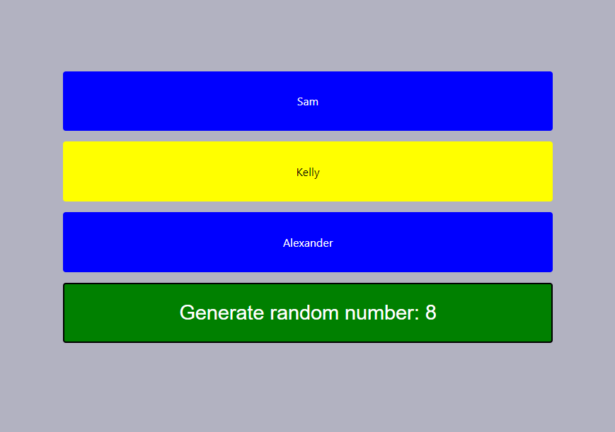

# Challenge para WestonDev

This project was bootstrapped with [Create React App](https://github.com/facebook/create-react-app).

Resultado deseado o final:

## Bases:

* Crear 3 ractangulos con nombres de ejemplo
* Los rectangulos deben ser dinamicos, es decir si agrego un nombre mas el rectangulo de ese nombre debe aparecer en automatico.
* Contar con un boton que arroje un numero random del 1 al 10 cada vez que se haga click en el.
* dependiendo del numero arrojado cambiara el color de algun rectangulo de acuerdo al siguiente criterio:
    * del 1 al 3 la primer tarjeta
    * del 4 al 7 la segunda
    * del 8 en adelante la tercera

    #### Nota se omiten los acentos deliberadamente

